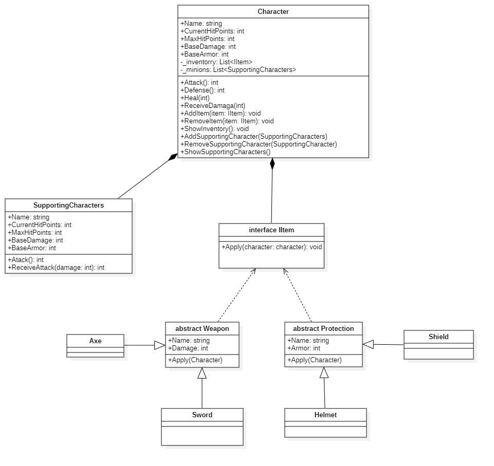

# ***DIAGRAMA UML***

## PRINCIPALES CLASES

### Character

*Atributos:*

* Name: El nombre del personaje.
* CurrentHitPoints, MaxHitPoints: Los puntos de vida actuales y máximos del personaje.
* BaseDamage: El daño base que el personaje puede infligir.
* BaseArmor: El valor de armadura base del personaje.
* _invetory: Una lista privada para almacenar los objetos (IItem) que posee el personaje.
* _supportingCharacters: Una lista privada para almacenar los personajes de apoyo.

*Metodos:*

* Attack(): Devuelve el daño base del personaje.
* Defense(): Devuelve la armadura base del personaje.
* Heal(int points): Cura al personaje por un número especificado de puntos, asegurándose de que no exceda los puntos de vida máximos.
* ReceiveDamage(int points): Reduce los puntos de vida actuales del personaje por un número especificado de puntos, asegurándose de que no caigan por debajo de cero.
* AddItem(IItem item): Añade un objeto al inventario del personaje.
* RemoveItem(IItem item): Elimina un objeto del inventario del personaje.
* ShowInventory(): Muestra todos los objetos en el inventario del personaje.
* ToString(): Devuelve una representación en cadena del estado actual del personaje.
### Subditos

*Atributos:*

* Name: El nombre del personaje de apoyo.
* CurrentHitPoints, MaxHitPoints: Los puntos de vida actuales y máximos del personaje de apoyo.
* BaseDamage: El daño base que el personaje de apoyo puede infligir.
* BaseArmor: El valor de armadura base del personaje de apoyo.

*Metodos:*

* Attack(): Devuelve el daño base del personaje de apoyo.
* Defense(): Devuelve la armadura base del personaje de apoyo.
* ReceiveDamage(int points): Reduce los puntos de vida actuales por un número especificado de puntos, asegurándose de que no caigan por debajo de cero.
* ToString(): Devuelve una representación en cadena del estado actual del personaje de apoyo.

## INTERFACE , CLASE ESTATICA "PERKS" Y  CLASES ABSTRACTAS
### ITEM
La interfaz IItem, define un contrato para los objetos que se pueden aplicar a un Character.

*Metodos:*

* Apply(Character character): Este método está destinado a aplicar el efecto del objeto a un Character dado.

### PROTECCION
La clase Protection,  es una clase abstracta que implementa la interfaz IItem. Representa un objeto de protección que puede ser aplicado a un Character.

*Atributos:*

* Name: El nombre del objeto de protección.
* Armor: El valor de armadura que proporciona el objeto de protección.

*Metodos:*

* Apply(Character character): Aplica el efecto del objeto de protección a un Character, incrementando su valor de armadura base.
* GetArmor(): Devuelve el valor de armadura del objeto de protección.
* ToString(): Devuelve una representación en cadena del estado actual del objeto de protección.

### WEAPON
La clase Weapons, es una clase abstracta que implementa la interfaz IItem. Representa un objeto de arma que puede ser aplicado a un Character.

*Atributos:*
* Name: El nombre del arma.
* Damage: El valor de daño que proporciona el arma.

*Metodos:*
* Apply(Character character): Aplica el efecto del arma a un Character, incrementando su daño base.
* GetDamage(): Devuelve el valor de daño del arma.
* ToString(): Devuelve una representación en cadena del estado actual del arma.

### PERKS
La clase Perks, es una clase estática que proporciona varios métodos y eventos para aplicar beneficios (perks) a personajes, armas, armaduras y personajes de apoyo en el juego.

*Metodos estaticos:*

Beneficios del Personaje

* ApplyHealthPerk(Character character): Incrementa los puntos de vida actuales del personaje en 10.
* ApplyHealthPerkCancel(Character character): Decrementa los puntos de vida actuales del personaje en 10.
* AppllyHealthHitPoints(Character character): Incrementa los puntos de vida máximos del personaje en 50.
* AppllyHealthHitPointsCancel(Character character): Decrementa los puntos de vida máximos del personaje en 50.
* ApplyDamagePerk(Character character): Incrementa el daño base del personaje en 10.
* ApplyDamagePerkCancel(Character character): Decrementa el daño base del personaje en 10.
* ApplyArmorPerk(Character character): Incrementa la armadura base del personaje en 10.
* ApplyArmorPerkCancel(Character character): Decrementa la armadura base del personaje en 10.

Beneficios de Armas

* ApplyWeaponsPerk(Weapons weapon): Incrementa el daño del arma en 50.
* ApplyWeaponsPerkCancel(Weapons weapon): Decrementa el daño del arma en 50.

Beneficios de Armaduras

* ApplyArmorPerk(Protection armor): Incrementa la armadura del objeto de protección en 10.
* ApplyArmorPerkCancel(Protection armor): Decrementa la armadura del objeto de protección en 10.

Beneficios de Minions

* ApplyDamageMinionPerk(SupportingCharacters subdito): Incrementa el daño base del personaje de apoyo en 50.
* ApplyDamageMinionPerkCancel(SupportingCharacters subdito): Decrementa el daño base del personaje de apoyo en 50.
* ApplyArmorMinionPerk(SupportingCharacters subdito): Incrementa la armadura base del personaje de apoyo en 10.
* ApplyArmorMinionPerkCancel(SupportingCharacters subdito): Decrementa la armadura base del personaje de apoyo en 10.

Beneficios Combinados

* ApplyWeaponsPerkAndMinions(Character character, Weapons weapon, SupportingCharacters supportingCharacters): Aplica el ataque del personaje y del personaje de apoyo, invocando un nuevo personaje de apoyo.
I* nvokeAttack(Character character, Weapons weapon, SupportingCharacters supportingCharacter): Dispara el evento OnAttack si hay suscriptores.

## RELACCIONES ENTRE CLASES

Este diagrama UML describe cómo las clases y sus relaciones están estructuradas en tu proyecto.

* Character tiene una relación de composición con IItem a través del atributo _inventory, que es una lista de objetos que implementan la interfaz IItem.
* Character tiene una relación de composición con SupportingCharacters a través del atributo _supportingCharacters, que es una lista de objetos de tipo SupportingCharacters.
* Las clases Protection y Weapons implementan la interfaz IItem.
 * La clase estática Perks interactúa con Character, Weapons, Protection, y SupportingCharacters a través de sus métodos estáticos.

